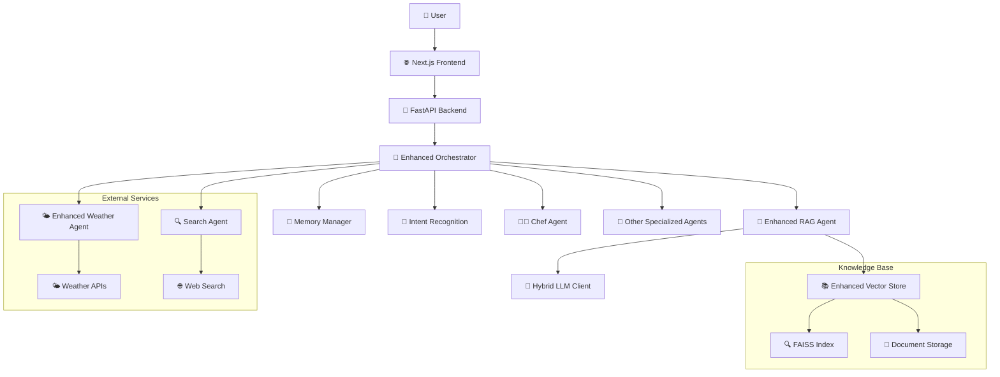

# 🍽️ FoodSave AI - Intelligent Culinary Assistant

[](https://python.org)
[](https://fastapi.tiangolo.com)
[](https://nextjs.org)
[](https://typescriptlang.org)
[](LICENSE)
[]()

> **Intelligent multi-agent AI system for sustainable food management and culinary assistance**

## 📋 Table of Contents

- [🚀 Quick Start](#-quick-start)
- [📖 Project Overview](#-project-overview)
- [🏗️ Architecture](#️-architecture)
- [🛠️ Technology Stack](#️-technology-stack)
- [📦 Installation](#-installation)
- [🚀 Usage](#-usage)
- [🧪 Testing](#-testing)
- [📊 Monitoring](#-monitoring)
- [🔧 Troubleshooting](#-troubleshooting)
- [📚 Documentation](#-documentation)
- [🤝 Contributing](#-contributing)
- [📄 License](#-license)

## 🚀 Quick Start

**Fastest way to get started:**

```bash
# 1. Clone the repository
git clone https://github.com/yourusername/foodsave-ai.git
cd foodsave-ai

# 2. Run the application with one command
./run_all.sh
```

**Application will be available at:**
- 🌐 Frontend: http://localhost:3000
- 🔧 Backend API: http://localhost:8000
- 📚 API Documentation: http://localhost:8000/docs

**To stop the application:**
```bash
./stop_all.sh
```

---

## 📖 Project Overview

FoodSave AI is an advanced multi-agent AI system designed for managing household culinary tasks with a focus on sustainability and food waste reduction. The system utilizes locally hosted language models through Ollama, ensuring privacy and user data control.

### 🎯 Key Features

- **🤖 Advanced Multi-Agent Architecture**: Specialized AI agents:
  - **👨‍🍳 Chef Agent**: Suggests recipes based on available ingredients
  - **🌤️ Weather Agent**: Provides real-time weather forecasts
  - **🔍 Search Agent**: Searches for information from the internet
  - **📷 OCR Agent**: Extracts data from receipt images
  - **📊 Analytics Agent**: Provides insights about shopping patterns
  - **📅 Meal Planner Agent**: Helps with meal planning
  - **🏷️ Categorization Agent**: Automatic product categorization
  - **🧠 RAG Agent**: Advanced Retrieval-Augmented Generation

- **⚡ Next.js Frontend**: Modern user interface with TypeScript
- **🧠 Advanced NLP**: Processing complex, multi-threaded commands
- **🔒 Local LLM Integration**: Uses Ollama for privacy
- **💾 Memory Management**: Enhanced conversation state tracking
- **🗄️ Database**: Tracks ingredients, receipts, and user preferences
- **📸 Receipt Scanning**: Automated receipt entry through OCR

## 🏗️ Architecture

### System Architecture Diagram



### Project Structure

```
my_ai_assistant/
├── 📁 src/backend/           # Backend Python/FastAPI
│   ├── 🤖 agents/           # AI agents
│   ├── 🔧 api/              # API endpoints
│   ├── ⚙️ core/             # Core services
│   ├── 🗄️ infrastructure/   # Database, cache, etc.
│   ├── 📊 models/           # Database models
│   └── 🧪 tests/            # Backend tests
├── 🌐 foodsave-frontend/     # Frontend Next.js
│   ├── 📱 src/app/          # App router
│   ├── 🧩 src/components/   # React components
│   ├── 🔗 src/services/     # API services
│   └── 🧪 tests/            # Frontend tests
├── 📚 docs/                 # Documentation
├── 🐳 docker-compose.yaml   # Docker setup
└── 📋 README.md             # This file
```

## 🛠️ Technology Stack

### Backend
- **🐍 Python 3.12+** - Main programming language
- **⚡ FastAPI** - Modern API framework
- **🗄️ SQLAlchemy** - ORM with async support
- **🤖 Ollama** - Local language models
- **🔍 FAISS** - Vector search engine
- **📊 Prometheus** - Monitoring and metrics

### Frontend
- **⚛️ Next.js 14** - React framework
- **🔷 TypeScript** - Type safety
- **🎨 Tailwind CSS** - Styling
- **🔗 TanStack Query** - State management
- **🧪 Jest + Playwright** - Testing

### DevOps
- **🐳 Docker** - Containerization
- **📦 Poetry** - Python dependency management
- **🧪 Pytest** - Testing framework
- **📊 Grafana** - Monitoring dashboard

## 📦 Installation

### Prerequisites

- **🐍 Python 3.12+**
- **🟢 Node.js 18.x or higher**
- **🤖 [Ollama](https://ollama.com/)** for local language models
- **📦 [Poetry](https://python-poetry.org/)** for Python dependency management

### Automatic Installation (Recommended)

Easiest way to get started:

```bash
# Clone the repository
git clone https://github.com/yourusername/foodsave-ai.git
cd foodsave-ai

# Run setup script (will install everything and start the application)
./run_all.sh
```

The script automatically:
- ✅ Checks all prerequisites
- ✅ Installs Python dependencies
- ✅ Installs Node.js dependencies
- ✅ Configures environment variables
- ✅ Starts backend and frontend
- ✅ Verifies everything is working

### Manual Installation

If you prefer to configure manually:

#### 1. Backend Setup
```bash
# Install Python dependencies
poetry install

# Activate virtual environment
poetry shell
```

#### 2. Frontend Setup
```bash
# Navigate to frontend directory
cd foodsave-frontend

# Install Node.js dependencies
npm install
```

#### 3. Ollama Configuration
```bash
# Install Ollama
curl -fsSL https://ollama.com/install.sh | sh

# Download required models (minimum 16GB RAM recommended)
ollama pull gemma3:latest  # ~5GB
ollama pull SpeakLeash/bielik-11b-v2.3-instruct:Q6_K  # ~7GB
ollama pull nomic-embed-text  # ~0.5GB

# Start Ollama
ollama serve
```

#### 4. Start Application
```bash
# Start backend
cd src/backend
uvicorn main:app --reload --host 0.0.0.0 --port 8000

# In another terminal, start frontend
cd foodsave-frontend
npm run dev
```

### Docker Setup

For containerized deployment:

```bash
# Build and run with Docker Compose
docker-compose up --build

# Or use rebuild script
./rebuild.sh
```

## 🚀 Usage

### Starting the Application

```bash
# Quick start (recommended)
./run_all.sh

# Manual start
./stop_all.sh  # Stop any running instances
./run_all.sh   # Start fresh
```

### Accessing the Application

- **🌐 Frontend**: http://localhost:3000
- **🔧 Backend API**: http://localhost:8000
- **📚 API Documentation**: http://localhost:8000/docs
- **📖 Alternative documentation**: http://localhost:8000/redoc

### Stopping the Application

```bash
./stop_all.sh
```

## 🧪 Testing

### Running Tests

```bash
# Run all tests with coverage
pytest --cov=src tests/ -v

# Run specific test types
pytest tests/unit/ -v
pytest tests/integration/ -v

# Run performance tests
locust -f locustfile.py
```

### Test Coverage
- **Current coverage**: ~95% (target: 90%)
- **Generate coverage report**:
  ```bash
  pytest --cov=src --cov-report=html tests/
  ```

## 📊 Monitoring

### Monitoring Endpoints
- **📊 `/metrics`** - Prometheus metrics
- **📈 `/api/v1/metrics`** - JSON metrics
- **📋 `/api/v1/status`** - Detailed system status
- **🚨 `/api/v1/alerts`** - Active alerts
- **📜 `/api/v1/alerts/history`** - Alert history
- **💚 `/health`** - Basic health check
- **✅ `/ready`** - Readiness check

### System Metrics
- **Memory usage**: Real-time monitoring
- **API performance**: Response times, throughput
- **Agent status**: Health checks for all agents
- **Database**: Connection pool, query performance

## 🔧 Troubleshooting

### Common Issues

1. **Port already in use:**
   ```bash
   ./stop_all.sh  # Stop existing processes
   ./run_all.sh   # Start fresh
   ```

2. **Ollama not working:**
   ```bash
   ollama serve
   ```

3. **Dependencies not installed:**
   ```bash
   poetry install
   cd foodsave-frontend && npm install
   ```

4. **Permission error:**
   ```bash
   chmod +x run_all.sh stop_all.sh
   ```

### Logs
- **Backend logs**: `logs/backend/`
- **Frontend logs**: `logs/frontend/`
- **Ollama logs**: `journalctl -u ollama -f` (Linux)

## �� Documentation

### Quick Start
- **[📖 Documentation Hub](docs/README.md)** - Complete documentation overview
- **[🚀 Deployment Guide](docs/DEPLOYMENT_GUIDE.md)** - Production deployment instructions
- **[👨‍💻 Contributing Guide](docs/CONTRIBUTING_GUIDE.md)** - How to contribute to the project

### Technical Documentation

- **[🏗️ System Architecture](docs/ARCHITECTURE_DOCUMENTATION.md)** - Detailed architecture description
- **[🔧 API Reference](docs/API_REFERENCE.md)** - Complete API endpoints documentation
- **[🤖 AI Agents Guide](docs/AGENTS_GUIDE.md)** - AI agents and orchestration
- **[🗄️ Database Guide](docs/DATABASE_GUIDE.md)** - Database structure and management
- **[🧪 Testing Guide](docs/TESTING_GUIDE.md)** - Testing strategies and best practices
- **[🚀 Deployment Guide](docs/DEPLOYMENT_GUIDE.md)** - Production deployment instructions
- **[🔒 Security Guide](docs/SECURITY_GUIDE.md)** - Security and privacy (coming soon)

### Specialized Guides

- **[🤖 RAG System Guide](docs/RAG_SYSTEM_GUIDE.md)** - Retrieval-Augmented Generation
- **[📊 Model Optimization Guide](docs/MODEL_OPTIMIZATION_GUIDE.md)** - AI model optimization
- **[💾 Backup System Guide](docs/BACKUP_SYSTEM_GUIDE.md)** - Backup and recovery procedures

### Archived Documentation

- **[📋 MDC Setup Summary](docs/MDC_SETUP_SUMMARY.md)** - Model Development Cycle setup
- **[📝 Frontend Implementation Plan](docs/frontend-implementation-plan.md)** - Frontend development roadmap
- **[✅ Frontend Implementation Checklist](docs/frontend-implementation-checklist.md)** - Frontend development checklist

### Documentation by Role

**👨‍💻 Developers**: [Contributing Guide](docs/CONTRIBUTING_GUIDE.md) | [API Reference](docs/API_REFERENCE.md) | [Testing Guide](docs/TESTING_GUIDE.md)

**🚀 DevOps**: [Deployment Guide](docs/DEPLOYMENT_GUIDE.md) | [Backup System Guide](docs/BACKUP_SYSTEM_GUIDE.md) | [Model Optimization Guide](docs/MODEL_OPTIMIZATION_GUIDE.md)

**🤖 AI/ML Engineers**: [Agents Guide](docs/AGENTS_GUIDE.md) | [RAG System Guide](docs/RAG_SYSTEM_GUIDE.md) | [Model Optimization Guide](docs/MODEL_OPTIMIZATION_GUIDE.md)

**📊 Data Engineers**: [Database Guide](docs/DATABASE_GUIDE.md) | [Architecture Documentation](docs/ARCHITECTURE_DOCUMENTATION.md)

## 🤝 Contributing

1. **Fork** the repository
2. Create a **feature branch** (`git checkout -b feature/amazing-feature`)
3. **Commit** your changes (`git commit -m 'Add amazing feature'`)
4. **Push** to the branch (`git push origin feature/amazing-feature`)
5. Open a **Pull Request**

### Coding Standards

- **Python**: Black, isort, flake8, mypy
- **TypeScript**: ESLint, Prettier
- **Tests**: Pytest for backend, Jest for frontend
- **Commit messages**: Conventional Commits

## 📄 License

This project is licensed under the MIT License - see the [LICENSE](LICENSE) file for details.

## 🆘 Support

For support and questions:
- Create an issue on GitHub
- Check the troubleshooting section above
- Review logs in `logs/backend/` and `logs/frontend/`

## 📈 Project Status

- **🟢 Status**: Active Development
- **📅 Last Updated**: 2024-12-21
- **🐛 Issues**: [GitHub Issues](https://github.com/yourusername/foodsave-ai/issues)
- **📊 Coverage**: 95%+
- **🧪 Tests**: Passing

---

**🍽️ FoodSave AI** - Intelligent culinary assistant for sustainable living
