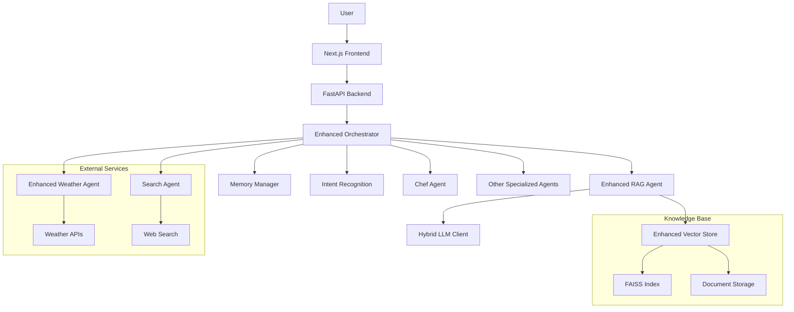

# FoodSave AI - Enhanced Modular Agent System

## Overview

FoodSave AI is a sophisticated, agent-based AI system designed to provide a conversational interface for various household tasks with a focus on food management and sustainability. It features an enhanced agent architecture with improved RAG capabilities, memory management, and specialized agents to manage shopping, assist with cooking, provide weather updates, and perform web searches. The system leverages locally-hosted language models via Ollama to ensure user privacy and data control.

## Key Features

- **Enhanced Multi-Agent Architecture**: A robust system of specialized agents with improved capabilities:
  - **Chef Agent**: Suggests recipes based on available pantry items.
  - **Enhanced Weather Agent**: Provides real-time weather forecasts with improved context awareness.
  - **Search Agent**: Fetches information from the web with improved relevance filtering.
  - **OCR Agent**: Extracts data from receipt images.
  - **Analytics Agent**: Provides insights into shopping patterns.
  - **Meal Planner Agent**: Helps with planning meals and generating shopping lists.
  - **Categorization Agent**: Automatically categorizes products from receipts.
  - **Enhanced RAG Agent**: Performs advanced Retrieval-Augmented Generation for superior conversational capabilities.
- **Next.js Frontend**: A modern, interactive user interface built with Next.js and TypeScript.
- **Advanced Natural Language Understanding**: Capable of processing complex, multi-threaded commands with improved context retention.
- **Local LLM Integration**: Utilizes Ollama for running language models locally, ensuring privacy.
- **Enhanced Memory Management**: Improved conversation state tracking and user preference management.
- **Database Storage**: Tracks pantry items, receipts, and user preferences using a local database.
- **Receipt Scanning**: Automates receipt entry through advanced OCR technology.

## System Architecture

The project is a monorepo containing two main components: a FastAPI backend and a Next.js frontend.

### Backend (`src/backend/`)

The backend is built with Python and FastAPI, handling the core logic and agent orchestration.

- **Agents (`src/backend/agents/`)**: The intelligence layer of the system.
  - `enhanced_orchestrator.py`: The central controller that intelligently routes requests to specialized agents.
  - `agent_factory.py`: A factory for creating agent instances.
  - `enhanced_base_agent.py`: The improved base class for all agents with enhanced error handling.
  - Specialized enhanced agents for cooking, weather, search, and information retrieval.
- **API (`src/backend/api/`)**: FastAPI endpoints for communication with the frontend.
- **Core (`src/backend/core/`)**: Enhanced services including:
  - `enhanced_vector_store.py`: Improved vector storage for RAG capabilities.
  - `hybrid_llm_client.py`: Flexible LLM integration supporting multiple models.
  - `memory.py`: Advanced conversation memory management.
  - `rag_document_processor.py`: Optimized document processing for RAG.

### Frontend (`foodsave-frontend/`)

The frontend is a modern web application built with Next.js and TypeScript.

- **App Router (`foodsave-frontend/src/app/`)**: Manages application routing and pages.
- **Components (`foodsave-frontend/src/components/`)**: Reusable React components, organized by feature.
- **Services (`foodsave-frontend/src/services/`)**: Handles business logic and API communication.
- **Hooks (`foodsave-frontend/src/hooks/`)**: Custom React hooks for state management and side effects.

## Enhanced Architecture Diagram



## Technology Stack

- **Backend**: Python 3.12+, FastAPI, SQLAlchemy
- **Frontend**: Next.js, React, TypeScript, Tailwind CSS
- **AI**: Ollama, LangChain, FAISS, Sentence Transformers
- **Database**: SQLite (default), compatible with PostgreSQL
- **DevOps**: Docker, Poetry
- **Testing**: pytest, pytest-cov, pytest-asyncio, Locust
- **Code Quality**: black, isort, flake8, ruff, mypy

## Testing Approach

The project uses a comprehensive testing strategy:

### Test Types
- **Unit Tests**: Test individual components in isolation (`tests/unit/`)
- **Integration Tests**: Test API endpoints and component interactions (`tests/integration/`)
- **E2E Tests**: Test complete workflows (`tests/e2e/`)
- **Performance Tests**: Load testing with Locust (`locustfile.py`)

### Running Tests
```bash
# Run all tests with coverage
pytest --cov=src tests/ -v

# Run specific test type
pytest tests/unit/ -v
pytest tests/integration/ -v

# Run performance tests
locust -f locustfile.py
```

### Test Coverage
- Current coverage: ~85% (target: 90%)
- Generate coverage report:
  ```bash
  pytest --cov=src --cov-report=html tests/
  ```

### Mocking Strategy
- External services are mocked using unittest.mock
- Database connections use test fixtures

## Setup & Installation

### Prerequisites

- Python 3.12+
- Node.js 18.x or higher
- [Ollama](https://ollama.com/) for local language models
- [Poetry](https://python-poetry.org/) for Python dependency management

### Installation Steps

1.  **Clone the repository:**
    ```bash
    git clone https://github.com/yourusername/foodsave-ai.git
    cd foodsave-ai
    ```

2.  **Set up the Backend:**
    ```bash
    # Install Python dependencies with grouped organization
    poetry install

    # Activate the virtual environment
    poetry shell
    ```

3.  **Alternative: Docker Setup:**
    ```bash
    # Use the provided rebuild script to build Docker containers
    ./rebuild.sh

    # Or manually build and run using docker-compose
    docker-compose up --build
    ```

3.  **Set up the Frontend:**
    ```bash
    # Navigate to the frontend directory
    cd foodsave-frontend

    # Install Node.js dependencies
    npm install
    ```

4.  **Configure Environment Variables:**
    Create a `.env` file in the project root by copying `.env.example` and customize the variables.
    ```bash
    cp .env.example .env
    ```

    Required API keys:
    - **NEWS_API_KEY**: Register at [newsapi.org](https://newsapi.org/register) to get a free API key
    - **BING_SEARCH_API_KEY**: Create a Bing Search API resource in [Azure Cognitive Services](https://portal.azure.com/#create/Microsoft.CognitiveServicesBingSearch-v7) to obtain a key
    - **DATABASE_URL**: Configure your database connection string (SQLite is used by default)

    Edit the `.env` file and replace the placeholder values with your actual API keys.

5.  **Set up Ollama:**
    Install Ollama from the [official website](https://ollama.com/) and pull the required models:
    ```bash
    ollama pull gemma3:latest
    ollama pull SpeakLeash/bielik-11b-v2.3-instruct:Q6_K
    ollama pull nomic-embed-text
    ```

    For GPU acceleration, refer to the [GPU Setup Guide](GPU_SETUP.md).

6.  **Initialize the Database:**
    ```bash
    # Make sure you are in the root directory with the Poetry shell activated
    python scripts/seed_db.py
    ```

7.  **Set up RAG System (Optional):**
    To utilize the enhanced RAG capabilities:
    ```bash
    # Index your documents
    python scripts/rag_cli.py --index-dir ./data/docs
    ```

### Running the Application

1.  **Start the Backend Server:**
    ```bash
    # From the project root, with Poetry shell activated
    uvicorn src.backend.main:app --reload --host 0.0.0.0 --port 8000
    ```

2.  **Start the Frontend Development Server:**
    In a new terminal, navigate to the frontend directory:
    ```bash
    cd foodsave-frontend
    npm run dev
    ```

The application will be available at `http://localhost:3000`.

## API Documentation

The backend API is documented using OpenAPI/Swagger. After starting the backend server, access the interactive documentation at:

```
http://localhost:8000/docs
```

This provides:
- Full API endpoint documentation
- Interactive testing capabilities
- Request/response schemas
- Authentication requirements

## Contribution Guidelines

We welcome contributions! Please follow these guidelines:

1. **Branching Strategy**:
   - Create feature branches from `main`
   - Use descriptive branch names (e.g., `feature/add-recipe-search`)

2. **Code Style**:
   - Follow PEP 8 for Python
   - Use TypeScript best practices for frontend
   - Run formatters before committing:
     ```bash
     black .
     isort .
     ```

3. **Testing**:
   - Add tests for new features
   - Maintain test coverage
   - Run all tests before submitting PRs

4. **Pull Requests**:
   - Include clear description of changes
   - Reference related issues
   - Request reviews from maintainers

5. **Issue Reporting**:
   - Use clear, descriptive titles
   - Include steps to reproduce
   - Specify expected vs actual behavior

## Project Status

### Current Implementation
- ✅ Enhanced multi-agent orchestration system
- ✅ Next.js chat interface
- ✅ FastAPI backend with database integration
- ✅ Local LLM integration via Ollama with hybrid capabilities
- ✅ Recipe suggestion based on pantry items
- ✅ Enhanced weather information retrieval
- ✅ OCR for receipt processing
- ✅ Advanced conversation state management
- ✅ Enhanced RAG for superior Q&A capabilities
- ✅ Improved vector storage for knowledge retrieval
- ✅ Advanced analytics for shopping patterns
- ✅ Automated categorization of products
- ✅ Meal planning and shopping list generation
- ✅ Advanced memory management system

### Upcoming Features
- ❌ Budget tracking and visualization
- ❌ Enhanced API versioning (v2)
- ❌ Improved error handling standardization
- ❌ Comprehensive test coverage (>90%)

### Note
This is a personal application designed for single-user use on desktop/laptop computers. No mobile support or authentication system is planned as it's intended for individual computer use only.

### Refactoring Progress
See [REFACTORING_PLAN.md](REFACTORING_PLAN.md) for detailed refactoring roadmap and progress.

## Development Tools

The project includes several development tools in the `dev/` directory:
- `check_imports.py`: Validates import availability
- `check_langchain.py`: Tests LangChain integration
- `find_text_splitter.py`: Utility for text processing optimization

## Working with Git

This project uses Git for version control. Here are some common Git operations:

```bash
# Check status of changes
git status

# Add all changes to staging
git add .

# Add specific files
git add README.md

# Commit changes
git commit -m "Your descriptive commit message"

# Push changes to remote repository
git push origin main

# Pull latest changes
git pull origin main

# Create a new branch
git checkout -b feature/your-new-feature
```

## Docker Support

The project includes Docker support for easier deployment and development:

- `Dockerfile`: Main application container
- `docker-compose.yml`: Multi-container setup
- `rebuild.sh`: Helper script to rebuild containers
- `.dockerignore`: Optimizes Docker builds

For GPU acceleration with NVIDIA Docker, use the provided setup script:
```bash
./scripts/setup_nvidia_docker.sh
```

## License

This project is licensed under the MIT License. See the [LICENSE](LICENSE) file for details.
