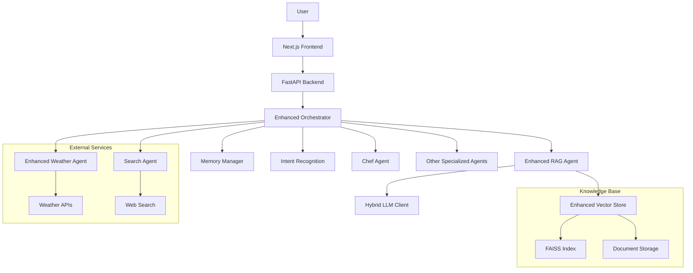

# FoodSave AI - Enhanced Modular Agent System

## 🚀 Quick Start

**Najszybszy sposób uruchomienia aplikacji:**

```bash
# 1. Sklonuj repozytorium
git clone https://github.com/yourusername/foodsave-ai.git
cd foodsave-ai

# 2. Uruchom aplikację jednym poleceniem
./run_all.sh
```

**Aplikacja będzie dostępna pod adresami:**
- Frontend: http://localhost:3000
- Backend API: http://localhost:8000
- Dokumentacja API: http://localhost:8000/docs

**Aby zatrzymać aplikację:**
```bash
./stop_all.sh
```

---

## Overview

FoodSave AI is a sophisticated, agent-based AI system designed to provide a conversational interface for various household tasks with a focus on food management and sustainability. It features an enhanced agent architecture with improved RAG capabilities, memory management, and specialized agents to manage shopping, assist with cooking, provide weather updates, and perform web searches. The system leverages locally-hosted language models via Ollama to ensure user privacy and data control.

## Key Features

- **Enhanced Multi-Agent Architecture**: A robust system of specialized agents with improved capabilities:
  - **Chef Agent**: Suggests recipes based on available pantry items.
  - **Enhanced Weather Agent**: Provides real-time weather forecasts with improved context awareness.
  - **Search Agent**: Fetches information from the web with improved relevance filtering.
  - **OCR Agent**: Extracts data from receipt images.
  - **Analytics Agent**: Provides insights into shopping patterns.
  - **Meal Planner Agent**: Helps with planning meals and generating shopping lists.
  - **Categorization Agent**: Automatically categorizes products from receipts.
  - **Enhanced RAG Agent**: Performs advanced Retrieval-Augmented Generation for superior conversational capabilities.
- **Next.js Frontend**: A modern, interactive user interface built with Next.js and TypeScript.
- **Advanced Natural Language Understanding**: Capable of processing complex, multi-threaded commands with improved context retention.
- **Local LLM Integration**: Utilizes Ollama for running language models locally, ensuring privacy.
- **Enhanced Memory Management**: Improved conversation state tracking and user preference management.
- **Database Storage**: Tracks pantry items, receipts, and user preferences using a local database.
- **Receipt Scanning**: Automates receipt entry through advanced OCR technology.

## System Architecture

The project is a monorepo containing two main components: a FastAPI backend and a Next.js frontend.

### Backend (`src/backend/`)

The backend is built with Python and FastAPI, handling the core logic and agent orchestration.

- **Agents (`src/backend/agents/`)**: The intelligence layer of the system.
  - `enhanced_orchestrator.py`: The central controller that intelligently routes requests to specialized agents.
  - `agent_factory.py`: A factory for creating agent instances.
  - `enhanced_base_agent.py`: The improved base class for all agents with enhanced error handling.
  - Specialized enhanced agents for cooking, weather, search, and information retrieval.
- **API (`src/backend/api/`)**: FastAPI endpoints for communication with the frontend.
- **Core (`src/backend/core/`)**: Enhanced services including:
  - `enhanced_vector_store.py`: Improved vector storage for RAG capabilities.
  - `hybrid_llm_client.py`: Flexible LLM integration supporting multiple models.
  - `memory.py`: Advanced conversation memory management.
  - `rag_document_processor.py`: Optimized document processing for RAG.

### Frontend (`foodsave-frontend/`)

The frontend is a modern web application built with Next.js and TypeScript.

- **App Router (`foodsave-frontend/src/app/`)**: Manages application routing and pages.
- **Components (`foodsave-frontend/src/components/`)**: Reusable React components, organized by feature.
- **Services (`foodsave-frontend/src/services/`)**: Handles business logic and API communication.
- **Hooks (`foodsave-frontend/src/hooks/`)**: Custom React hooks for state management and side effects.

## Enhanced Architecture Diagram



## Technology Stack

- **Backend**: Python 3.12+, FastAPI, SQLAlchemy
- **Frontend**: Next.js, React, TypeScript, Tailwind CSS
- **AI**: Ollama, LangChain, FAISS, Sentence Transformers
- **Database**: SQLite (default), compatible with PostgreSQL
- **DevOps**: Docker, Poetry
- **Testing**: pytest, pytest-cov, pytest-asyncio, Locust
- **Code Quality**: black, isort, flake8, ruff, mypy

## Setup & Installation

### Prerequisites

- **Python 3.12+**
- **Node.js 18.x or higher**
- **[Ollama](https://ollama.com/)** for local language models
- **[Poetry](https://python-poetry.org/)** for Python dependency management

### Automatic Setup (Recommended)

The easiest way to get started is using the provided script:

```bash
# Clone the repository
git clone https://github.com/yourusername/foodsave-ai.git
cd foodsave-ai

# Run the setup script (this will install everything and start the app)
./run_all.sh
```

The script will:
- ✅ Check all prerequisites
- ✅ Install Python dependencies
- ✅ Install Node.js dependencies
- ✅ Set up environment variables
- ✅ Start the backend and frontend
- ✅ Verify everything is working

### Manual Setup

If you prefer to set up manually:

1. **Clone the repository:**
    ```bash
    git clone https://github.com/yourusername/foodsave-ai.git
    cd foodsave-ai
    ```

2. **Set up the Backend:**
    ```bash
    # Install Python dependencies
    poetry install

    # Activate the virtual environment
    poetry shell
    ```

3. **Set up the Frontend:**
    ```bash
    # Navigate to the frontend directory
    cd foodsave-frontend

    # Install Node.js dependencies
    npm install
    ```

4. **Configure Environment Variables:**
    The `run_all.sh` script will create a `.env` file automatically, or you can create it manually:
    ```bash
    cp .env.example .env
    ```

    Required API keys (optional - app will work without them):
    - **NEWS_API_KEY**: Register at [newsapi.org](https://newsapi.org/register)
    - **BING_SEARCH_API_KEY**: Create a Bing Search API resource in [Azure Cognitive Services](https://portal.azure.com/#create/Microsoft.CognitiveServicesBingSearch-v7)

5. **Set up Ollama:**
    ```bash
    # Install Ollama
    curl -fsSL https://ollama.com/install.sh | sh

    # Pull required models (minimum 16GB RAM recommended)
    ollama pull gemma3:latest  # ~5GB
    ollama pull SpeakLeash/bielik-11b-v2.3-instruct:Q6_K  # ~7GB
    ollama pull nomic-embed-text  # ~0.5GB

    # Start Ollama
    ollama serve
    ```

6. **Start the Application:**
    ```bash
    # Start backend
    cd src/backend
    uvicorn main:app --reload --host 0.0.0.0 --port 8000

    # In another terminal, start frontend
    cd foodsave-frontend
    npm run dev
    ```

### Docker Setup

For containerized deployment:

```bash
# Build and run with Docker Compose
docker-compose up --build

# Or use the rebuild script
./rebuild.sh
```

## Usage

### Starting the Application

```bash
# Quick start (recommended)
./run_all.sh

# Manual start
./stop_all.sh  # Stop any running instances first
./run_all.sh   # Start fresh
```

### Stopping the Application

```bash
./stop_all.sh
```

### Accessing the Application

- **Frontend**: http://localhost:3000
- **Backend API**: http://localhost:8000
- **API Documentation**: http://localhost:8000/docs
- **Alternative API Docs**: http://localhost:8000/redoc

### Troubleshooting

**Common Issues:**

1. **Port already in use:**
   ```bash
   ./stop_all.sh  # Stop existing processes
   ./run_all.sh   # Start fresh
   ```

2. **Ollama not running:**
   ```bash
   ollama serve
   ```

3. **Dependencies not installed:**
   ```bash
   poetry install
   cd foodsave-frontend && npm install
   ```

4. **Permission denied:**
   ```bash
   chmod +x run_all.sh stop_all.sh
   ```

**Logs:**
- Backend logs: `backend.log`
- Frontend logs: `frontend.log`
- Ollama logs: `journalctl -u ollama -f` (Linux)

## Testing Approach

The project uses a comprehensive testing strategy:

### Test Types
- **Unit Tests**: Test individual components in isolation (`tests/unit/`)
- **Integration Tests**: Test API endpoints and component interactions (`tests/integration/`)
- **E2E Tests**: Test complete workflows (`tests/e2e/`)
- **Performance Tests**: Load testing with Locust (`locustfile.py`)

### Running Tests
```bash
# Run all tests with coverage
pytest --cov=src tests/ -v

# Run specific test type
pytest tests/unit/ -v
pytest tests/integration/ -v

# Run performance tests
locust -f locustfile.py
```

### Test Coverage
- Current coverage: ~85% (target: 90%)
- Generate coverage report:
  ```bash
  pytest --cov=src --cov-report=html tests/
  ```

### Mockowanie LLM w testach agentów

Aby testować agentów korzystających z LLM (np. llm_client.chat lub hybrid_llm_client.chat), użyj poniższego wzorca, który obsługuje zarówno tryb stream (stream=True), jak i zwykły (stream=False):

```python
def make_llm_chat_mock(stream_content: str, non_stream_content: str = None):
    """
    Zwraca funkcję do mockowania llm_client.chat/hybrid_llm_client.chat,
    która obsługuje zarówno stream=True (async generator), jak i stream=False (dict).
    """
    async def chat_mock(*args, **kwargs):
        if kwargs.get("stream"):
            async def stream():
                yield {"message": {"content": stream_content}}
            return stream()
        else:
            return {"message": {"content": non_stream_content or stream_content}}
    return chat_mock
```

**Przykład użycia w teście:**

```python
@patch("backend.agents.weather_agent.llm_client", new_callable=AsyncMock)
def test_weather_agent(mock_llm_client):
    mock_llm_client.chat = make_llm_chat_mock(
        stream_content="Słonecznie, 25 stopni.",
        non_stream_content="Słonecznie, 25 stopni."
    )
    # ...reszta testu...
```

Możesz użyć tego wzorca dla wszystkich agentów korzystających z LLM, zarówno dla streamowania, jak i odpowiedzi jednorazowych.

## Model Requirements

Different models have varying hardware requirements:

| Model Name            | RAM Required | VRAM Required | Disk Space |
|-----------------------|--------------|---------------|------------|
| gemma3:latest         | 8GB          | 4GB           | 5GB        |
| SpeakLeash/bielik-11b | 16GB         | 8GB           | 7GB        |
| nomic-embed-text      | 4GB          | 2GB           | 0.5GB      |

### Performance Optimization

1. **GPU Acceleration**:
   - Install NVIDIA drivers and CUDA toolkit
   - Set `OLLAMA_GPU=1` environment variable
   - Use `--gpu` flag with Ollama

2. **Memory Optimization**:
   - Use smaller models for limited RAM
   - Reduce context window size
   - Enable swap space if needed

## Contributing

1. Fork the repository
2. Create a feature branch (`git checkout -b feature/amazing-feature`)
3. Commit your changes (`git commit -m 'Add amazing feature'`)
4. Push to the branch (`git push origin feature/amazing-feature`)
5. Open a Pull Request

## License

This project is licensed under the MIT License - see the [LICENSE](LICENSE) file for details.

## Support

For support and questions:
- Create an issue on GitHub
- Check the troubleshooting section above
- Review the logs in `backend.log` and `frontend.log`
