# 🤖 AI Agents Guide - FoodSave AI

## 📋 Overview

FoodSave AI employs a sophisticated multi-agent architecture where specialized AI agents handle different aspects of culinary assistance and food management. Each agent is designed with specific responsibilities and capabilities to provide comprehensive support for sustainable cooking and food waste reduction.

## 🏗️ Agent Architecture

### Agent Hierarchy

```mermaid
graph TD
    User[👤 User] --> Orchestrator[🎯 Enhanced Orchestrator]

    Orchestrator --> IntentDetector[🧠 Intent Detector]
    IntentDetector --> Router[🔄 Agent Router]

    Router --> ChefAgent[👨‍🍳 Chef Agent]
    Router --> WeatherAgent[🌤️ Weather Agent]
    Router --> SearchAgent[🔍 Search Agent]
    Router --> OCRAgent[📷 OCR Agent]
    Router --> RAGAgent[🧠 RAG Agent]
    Router --> MealPlannerAgent[📅 Meal Planner Agent]
    Router --> CategorizationAgent[🏷️ Categorization Agent]
    Router --> GeneralConversationAgent[💬 General Conversation Agent]

    ChefAgent --> MemoryManager[💾 Memory Manager]
    WeatherAgent --> WeatherAPI[🌤️ Weather APIs]
    SearchAgent --> WebSearch[🌐 Web Search]
    OCRAgent --> ImageProcessor[🖼️ Image Processing]
    RAGAgent --> VectorStore[📚 Vector Store]

    MemoryManager --> Database[🗄️ Database]
    VectorStore --> FAISS[🔍 FAISS Index]
```



## 🎯 Agent Responsibilities

### 1. 👨‍🍳 Chef Agent

**Primary Responsibility**: Recipe generation, cooking advice, and culinary expertise

**Key Features**:
- Recipe suggestions based on available ingredients
- Cooking technique explanations
- Ingredient substitutions
- Nutritional information
- Dietary restriction compliance
- Cooking time and difficulty estimation

**Example Commands**:
```
"What can I cook with chicken, rice, and onions?"
"How do I make pasta carbonara?"
"Substitute for eggs in baking"
"What's the best way to cook salmon?"
"Give me a vegetarian recipe for dinner"
```

**Implementation**:
```python
class ChefAgent(BaseAgent):
    """Specialized agent for culinary expertise and recipe generation"""

    def __init__(self):
        super().__init__("chef_agent")
        self.recipe_database = RecipeDatabase()
        self.nutrition_analyzer = NutritionAnalyzer()

    async def process_query(self, query: str, context: Dict) -> AgentResponse:
        # Analyze available ingredients
        ingredients = self.extract_ingredients(query, context)

        # Generate recipe suggestions
        recipes = await self.recipe_database.find_recipes(ingredients)

        # Consider dietary restrictions
        filtered_recipes = self.apply_dietary_filters(recipes, context)

        return AgentResponse(
            content=self.format_recipe_response(filtered_recipes),
            confidence=0.95,
            suggestions=self.generate_cooking_tips()
        )
```

### 2. 🌤️ Weather Agent

**Primary Responsibility**: Weather information and its impact on cooking and food planning

**Key Features**:
- Current weather conditions
- Weather forecasts
- Seasonal ingredient recommendations
- Weather-based cooking suggestions
- Outdoor cooking advice
- Food storage recommendations based on weather

**Example Commands**:
```
"What's the weather like today?"
"Should I grill outside this weekend?"
"What seasonal ingredients are available now?"
"How should I store food in this weather?"
"Best recipes for rainy days"
```

**Implementation**:
```python
class WeatherAgent(BaseAgent):
    """Agent for weather-related culinary decisions"""

    def __init__(self):
        super().__init__("weather_agent")
        self.weather_client = WeatherAPIClient()
        self.seasonal_guide = SeasonalIngredientGuide()

    async def process_query(self, query: str, context: Dict) -> AgentResponse:
        # Get current weather
        location = self.extract_location(query, context)
        weather_data = await self.weather_client.get_current_weather(location)

        # Analyze weather impact on cooking
        cooking_recommendations = self.analyze_weather_impact(weather_data)

        # Get seasonal ingredients
        seasonal_ingredients = self.seasonal_guide.get_current_season_ingredients()

        return AgentResponse(
            content=self.format_weather_response(weather_data, cooking_recommendations),
            confidence=0.90,
            suggestions=seasonal_ingredients
        )
```

### 3. 🔍 Search Agent

**Primary Responsibility**: Web search and information retrieval for culinary topics

**Key Features**:
- Web search for recipes and cooking information
- Food trend analysis
- Restaurant recommendations
- Ingredient sourcing information
- Cooking technique research
- Food safety information

**Example Commands**:
```
"Find the best pizza recipe online"
"What are the latest food trends?"
"Where can I buy fresh herbs near me?"
"How to properly store different types of cheese?"
"Best restaurants for Italian food in my area"
```

**Implementation**:
```python
class SearchAgent(BaseAgent):
    """Agent for web search and information retrieval"""

    def __init__(self):
        super().__init__("search_agent")
        self.web_search = WebSearchClient()
        self.content_filter = ContentFilter()

    async def process_query(self, query: str, context: Dict) -> AgentResponse:
        # Perform web search
        search_results = await self.web_search.search(query)

        # Filter and rank results
        filtered_results = self.content_filter.filter_results(search_results)
        ranked_results = self.rank_results(filtered_results, query)

        # Extract relevant information
        relevant_info = self.extract_relevant_information(ranked_results)

        return AgentResponse(
            content=self.format_search_response(relevant_info),
            confidence=0.85,
            sources=ranked_results[:3]
        )
```

### 4. 📷 OCR Agent

**Primary Responsibility**: Receipt and document processing using Optical Character Recognition

**Key Features**:
- Receipt text extraction
- Product information parsing
- Price and quantity detection
- Store identification
- Date extraction
- Receipt categorization

**Example Commands**:
```
"Scan this receipt"
"Extract items from this shopping receipt"
"What did I buy at the grocery store?"
"Add these items to my pantry"
"Track my grocery spending"
```

**Implementation**:
```python
class OCRAgent(BaseAgent):
    """Agent for receipt and document processing"""

    def __init__(self):
        super().__init__("ocr_agent")
        self.ocr_engine = OCREngine()
        self.receipt_parser = ReceiptParser()
        self.product_matcher = ProductMatcher()

    async def process_image(self, image_data: bytes, context: Dict) -> AgentResponse:
        # Extract text from image
        extracted_text = await self.ocr_engine.extract_text(image_data)

        # Parse receipt structure
        receipt_data = self.receipt_parser.parse(extracted_text)

        # Match products with database
        matched_products = await self.product_matcher.match_products(receipt_data.items)

        # Categorize items
        categorized_items = self.categorize_items(matched_products)

        return AgentResponse(
            content=self.format_receipt_response(receipt_data, categorized_items),
            confidence=receipt_data.confidence,
            extracted_data=receipt_data
        )
```

### 5. 🧠 RAG Agent

**Primary Responsibility**: Retrieval-Augmented Generation for knowledge-based responses

**Key Features**:
- Document-based question answering
- Knowledge base queries
- Context-aware responses
- Source citation
- Multi-document synthesis
- Learning from uploaded content

**Example Commands**:
```
"What does my cooking guide say about knife safety?"
"Find information about sustainable cooking in my documents"
"What are the health benefits of olive oil according to my research?"
"Summarize the key points from my recipe collection"
```

**Implementation**:
```python
class RAGAgent(BaseAgent):
    """Agent for retrieval-augmented generation"""

    def __init__(self):
        super().__init__("rag_agent")
        self.vector_store = VectorStore()
        self.llm_client = HybridLLMClient()
        self.document_processor = DocumentProcessor()

    async def process_query(self, query: str, context: Dict) -> AgentResponse:
        # Generate query embedding
        query_embedding = await self.llm_client.embed_query(query)

        # Retrieve relevant documents
        relevant_docs = await self.vector_store.search(
            query_embedding,
            top_k=5,
            filters=context.get('filters', {})
        )

        # Generate response using retrieved context
        response = await self.llm_client.generate_response(
            query=query,
            context_docs=relevant_docs,
            user_context=context
        )

        return AgentResponse(
            content=response.content,
            confidence=response.confidence,
            sources=[doc.metadata for doc in relevant_docs]
        )
```

### 6. 📅 Meal Planner Agent

**Primary Responsibility**: Meal planning and scheduling assistance

**Key Features**:
- Weekly meal planning
- Shopping list generation
- Nutritional balance analysis
- Time-based meal suggestions
- Leftover utilization
- Budget-friendly meal planning

**Example Commands**:
```
"Plan my meals for this week"
"Create a shopping list for dinner tonight"
"What should I cook for a family of four?"
"Plan meals that use my leftover chicken"
"Suggest meals for a busy work week"
```

**Implementation**:
```python
class MealPlannerAgent(BaseAgent):
    """Agent for meal planning and scheduling"""

    def __init__(self):
        super().__init__("meal_planner_agent")
        self.meal_database = MealDatabase()
        self.nutrition_calculator = NutritionCalculator()
        self.shopping_list_generator = ShoppingListGenerator()

    async def process_query(self, query: str, context: Dict) -> AgentResponse:
        # Analyze user preferences and constraints
        preferences = self.extract_preferences(query, context)
        constraints = self.extract_constraints(query, context)

        # Generate meal plan
        meal_plan = await self.meal_database.generate_meal_plan(
            preferences=preferences,
            constraints=constraints,
            available_ingredients=context.get('pantry', [])
        )

        # Generate shopping list
        shopping_list = self.shopping_list_generator.generate_list(meal_plan)

        # Calculate nutritional balance
        nutrition_analysis = self.nutrition_calculator.analyze_plan(meal_plan)

        return AgentResponse(
            content=self.format_meal_plan_response(meal_plan, shopping_list),
            confidence=0.88,
            suggestions=nutrition_analysis.recommendations
        )
```

### 7. 🏷️ Categorization Agent

**Primary Responsibility**: Automatic categorization and tagging of food items and recipes

**Key Features**:
- Ingredient categorization
- Recipe tagging
- Dietary classification
- Cuisine type identification
- Difficulty level assessment
- Seasonal classification

**Example Commands**:
```
"Categorize these ingredients"
"Tag this recipe as vegetarian"
"What type of cuisine is this?"
"Classify this recipe by difficulty"
"Organize my recipe collection"
```

**Implementation**:
```python
class CategorizationAgent(BaseAgent):
    """Agent for automatic categorization and tagging"""

    def __init__(self):
        super().__init__("categorization_agent")
        self.classifier = MLClassifier()
        self.taxonomy = FoodTaxonomy()
        self.tag_suggestions = TagSuggestionEngine()

    async def process_query(self, query: str, context: Dict) -> AgentResponse:
        # Extract items to categorize
        items = self.extract_items(query, context)

        # Perform classification
        classifications = await self.classifier.classify_batch(items)

        # Generate tags
        tags = self.tag_suggestions.generate_tags(items, classifications)

        # Organize by taxonomy
        organized_items = self.taxonomy.organize(items, classifications)

        return AgentResponse(
            content=self.format_categorization_response(organized_items, tags),
            confidence=0.92,
            suggestions=self.generate_organization_tips()
        )
```

### 8. 💬 General Conversation Agent

**Primary Responsibility**: General conversation and fallback handling

**Key Features**:
- General chat and conversation
- Intent clarification
- Fallback responses
- System navigation help
- Feature explanations
- Error handling

**Example Commands**:
```
"Hello, how are you?"
"What can you help me with?"
"I don't understand, can you explain?"
"Help me navigate the app"
"What features do you have?"
```

**Implementation**:
```python
class GeneralConversationAgent(BaseAgent):
    """Agent for general conversation and fallback handling"""

    def __init__(self):
        super().__init__("general_conversation_agent")
        self.conversation_manager = ConversationManager()
        self.intent_clarifier = IntentClarifier()
        self.help_system = HelpSystem()

    async def process_query(self, query: str, context: Dict) -> AgentResponse:
        # Analyze conversation context
        conversation_history = context.get('conversation_history', [])

        # Check if clarification is needed
        if self.needs_clarification(query):
            clarification = self.intent_clarifier.generate_clarification(query)
            return AgentResponse(
                content=clarification,
                confidence=0.70,
                requires_clarification=True
            )

        # Generate appropriate response
        response = await self.conversation_manager.generate_response(
            query=query,
            history=conversation_history,
            context=context
        )

        # Add helpful suggestions
        suggestions = self.help_system.get_relevant_help(query)

        return AgentResponse(
            content=response,
            confidence=0.80,
            suggestions=suggestions
        )
```

## 🧠 Intent Detection

### Intent Recognition System

The system uses a multi-layered approach to detect user intent:

```python
class IntentDetector:
    """Multi-layered intent detection system"""

    def __init__(self):
        self.keyword_matcher = KeywordMatcher()
        self.ml_classifier = MLIntentClassifier()
        self.context_analyzer = ContextAnalyzer()

    async def detect_intent(self, query: str, context: Dict) -> IntentResult:
        # Layer 1: Keyword matching
        keyword_intent = self.keyword_matcher.match(query)

        # Layer 2: ML classification
        ml_intent = await self.ml_classifier.classify(query)

        # Layer 3: Context analysis
        context_intent = self.context_analyzer.analyze(query, context)

        # Combine results
        final_intent = self.combine_intents(keyword_intent, ml_intent, context_intent)

        return IntentResult(
            primary_agent=final_intent.primary_agent,
            confidence=final_intent.confidence,
            fallback_agents=final_intent.fallback_agents
        )
```

### Intent Categories

| Intent | Keywords | Primary Agent | Confidence Threshold |
|--------|----------|---------------|---------------------|
| Recipe Request | "cook", "recipe", "make", "prepare" | Chef Agent | 0.8 |
| Weather Query | "weather", "temperature", "forecast" | Weather Agent | 0.7 |
| Search Request | "find", "search", "look up" | Search Agent | 0.8 |
| Receipt Processing | "receipt", "scan", "upload" | OCR Agent | 0.9 |
| Knowledge Query | "what does", "according to", "in my documents" | RAG Agent | 0.8 |
| Meal Planning | "plan", "schedule", "weekly meals" | Meal Planner Agent | 0.8 |
| Categorization | "categorize", "tag", "organize" | Categorization Agent | 0.8 |
| General Chat | "hello", "help", "what can you do" | General Conversation Agent | 0.6 |

## 🔄 Agent Orchestration

### Enhanced Orchestrator

```python
class EnhancedOrchestrator:
    """Orchestrates agent interactions and manages request flow"""

    def __init__(self):
        self.agent_registry = AgentRegistry()
        self.intent_detector = IntentDetector()
        self.memory_manager = MemoryManager()
        self.circuit_breaker = CircuitBreakerMonitor()

    async def process_request(self, request: ChatRequest) -> OrchestratorResponse:
        # Detect intent
        intent = await self.intent_detector.detect_intent(
            request.message,
            request.context
        )

        # Get primary agent
        primary_agent = self.agent_registry.get_agent(intent.primary_agent)

        # Check circuit breaker
        if self.circuit_breaker.is_open(primary_agent.name):
            # Use fallback agent
            fallback_agent = self.agent_registry.get_agent(intent.fallback_agents[0])
            response = await fallback_agent.process_query(request.message, request.context)
        else:
            # Process with primary agent
            response = await primary_agent.process_query(request.message, request.context)

            # Update circuit breaker
            self.circuit_breaker.record_result(primary_agent.name, response.success)

        # Update memory
        await self.memory_manager.update_session(
            request.session_id,
            request.message,
            response
        )

        return OrchestratorResponse(
            response=response,
            agent_used=primary_agent.name,
            confidence=intent.confidence
        )
```

## 🏭 Agent Factory Pattern

### Agent Factory Implementation

```python
class AgentFactory:
    """Factory for creating and managing agent instances"""

    def __init__(self):
        self.agent_configs = self.load_agent_configs()
        self.agent_pool = {}

    def create_agent(self, agent_type: str) -> BaseAgent:
        """Create a new agent instance"""
        if agent_type not in self.agent_configs:
            raise ValueError(f"Unknown agent type: {agent_type}")

        config = self.agent_configs[agent_type]

        # Create agent based on type
        if agent_type == "chef_agent":
            return ChefAgent(config)
        elif agent_type == "weather_agent":
            return WeatherAgent(config)
        elif agent_type == "search_agent":
            return SearchAgent(config)
        elif agent_type == "ocr_agent":
            return OCRAgent(config)
        elif agent_type == "rag_agent":
            return RAGAgent(config)
        elif agent_type == "meal_planner_agent":
            return MealPlannerAgent(config)
        elif agent_type == "categorization_agent":
            return CategorizationAgent(config)
        elif agent_type == "general_conversation_agent":
            return GeneralConversationAgent(config)
        else:
            raise ValueError(f"Unsupported agent type: {agent_type}")

    def get_agent(self, agent_type: str) -> BaseAgent:
        """Get or create agent instance (singleton pattern)"""
        if agent_type not in self.agent_pool:
            self.agent_pool[agent_type] = self.create_agent(agent_type)
        return self.agent_pool[agent_type]
```

## 🧪 Testing Agents

### Unit Testing

```python
class TestChefAgent:
    """Unit tests for Chef Agent"""

    def setup_method(self):
        self.agent = ChefAgent()
        self.test_context = {
            "available_ingredients": ["chicken", "rice", "onions"],
            "dietary_restrictions": ["vegetarian"]
        }

    async def test_recipe_suggestion(self):
        """Test recipe suggestion functionality"""
        query = "What can I cook with chicken and rice?"
        response = await self.agent.process_query(query, self.test_context)

        assert response.confidence > 0.8
        assert "recipe" in response.content.lower()
        assert len(response.suggestions) > 0

    async def test_dietary_filtering(self):
        """Test dietary restriction filtering"""
        query = "Give me a vegetarian recipe"
        response = await self.agent.process_query(query, self.test_context)

        # Verify no meat ingredients in suggestions
        assert "chicken" not in response.content.lower()
        assert "beef" not in response.content.lower()
```

### Integration Testing

```python
class TestAgentOrchestration:
    """Integration tests for agent orchestration"""

    def setup_method(self):
        self.orchestrator = EnhancedOrchestrator()

    async def test_intent_detection_and_routing(self):
        """Test intent detection and agent routing"""
        request = ChatRequest(
            message="What can I cook with chicken?",
            session_id="test_session",
            context={}
        )

        response = await self.orchestrator.process_request(request)

        assert response.agent_used == "chef_agent"
        assert response.confidence > 0.7
        assert response.response.success
```

## 📊 Agent Monitoring

### Performance Metrics

Each agent reports key metrics:

```python
class AgentMetrics:
    """Metrics collection for agent performance"""

    def __init__(self):
        self.request_count = Counter()
        self.response_time = Histogram()
        self.error_count = Counter()
        self.confidence_scores = Histogram()

    def record_request(self, agent_name: str, response_time: float,
                      confidence: float, success: bool):
        """Record agent request metrics"""
        self.request_count.labels(agent=agent_name).inc()
        self.response_time.labels(agent=agent_name).observe(response_time)
        self.confidence_scores.labels(agent=agent_name).observe(confidence)

        if not success:
            self.error_count.labels(agent=agent_name).inc()
```

### Health Checks

```python
class AgentHealthChecker:
    """Health checking for all agents"""

    async def check_agent_health(self, agent: BaseAgent) -> HealthStatus:
        """Check if agent is healthy"""
        try:
            # Test with simple query
            test_response = await agent.process_query(
                "test query",
                {"test": True}
            )

            return HealthStatus(
                agent_name=agent.name,
                status="healthy",
                response_time=test_response.processing_time,
                last_check=datetime.now()
            )
        except Exception as e:
            return HealthStatus(
                agent_name=agent.name,
                status="unhealthy",
                error=str(e),
                last_check=datetime.now()
            )
```

## ⚙️ Configuration

### Agent Configuration

```yaml
# config/agents.yaml
agents:
  chef_agent:
    enabled: true
    max_response_time: 5.0
    confidence_threshold: 0.8
    fallback_agent: "general_conversation_agent"

  weather_agent:
    enabled: true
    max_response_time: 3.0
    confidence_threshold: 0.7
    api_key: "${WEATHER_API_KEY}"

  search_agent:
    enabled: true
    max_response_time: 10.0
    confidence_threshold: 0.8
    max_results: 5

  ocr_agent:
    enabled: true
    max_response_time: 15.0
    confidence_threshold: 0.9
    supported_formats: ["jpg", "png", "pdf"]

  rag_agent:
    enabled: true
    max_response_time: 8.0
    confidence_threshold: 0.8
    vector_store_path: "./data/vector_store"

  meal_planner_agent:
    enabled: true
    max_response_time: 6.0
    confidence_threshold: 0.8
    planning_horizon: 7

  categorization_agent:
    enabled: true
    max_response_time: 4.0
    confidence_threshold: 0.8
    model_path: "./models/categorization_model"

  general_conversation_agent:
    enabled: true
    max_response_time: 2.0
    confidence_threshold: 0.6
    always_available: true
```

## 🔧 Troubleshooting

### Common Agent Issues

1. **Agent Not Responding**
   - Check agent health status
   - Verify configuration
   - Check dependencies

2. **Low Confidence Scores**
   - Review training data
   - Check intent detection
   - Verify agent specialization

3. **Slow Response Times**
   - Monitor resource usage
   - Check external API calls
   - Optimize agent logic

4. **Circuit Breaker Trips**
   - Check external dependencies
   - Review error logs
   - Implement fallback strategies

---

**Last Updated**: 2024-12-21
**Agent Version**: 2.0.0
